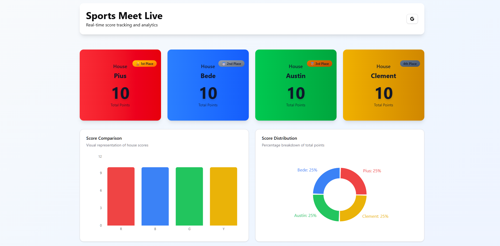

# 🏅 Live Sports Meet Scoreboard

A **real-time scoreboard** for school sports meet events, built with **Next.js**, **Tailwind CSS**, and **TypeScript**, using **Server-Sent Events (SSE)** for live updates.



---

## ⚡ Features

- Real-time score updates for multiple houses using **Server-Sent Events (SSE)**  
- Google authentication for secure admin access  
- Admin controls to **add points**, **reset scores**, and **manage events**  
- Responsive and clean UI powered by **Tailwind CSS**  
- Score persistence (requires remote storage for production)  

---

## 🛠️ Tech Stack

- **Next.js** – React framework with server-side rendering & API routes  
- **React** – Frontend library for building UI components  
- **Tailwind CSS** – Utility-first CSS for rapid styling  
- **TypeScript** – Static typing for safer, scalable code  

---

## 🏗️ Project Architecture

The project follows a standard Next.js `app` directory structure:

- **Frontend:** Built with React, TypeScript, and Tailwind CSS, the frontend is located in the `app` and `components` directories. It consumes data from the backend via API routes.
- **Backend:** The backend is implemented using Next.js API Routes (`app/api`). It handles authentication, score updates, and broadcasts real-time updates using Server-Sent Events (SSE).
- **Data Storage:** Scores are stored in a local JSON file (`data/scores.json`). This is simple for development but has limitations for production deployment.

---

## 🚀 Getting Started

1. **Clone the repository**:
   ```bash
   git clone https://github.com/VikumKarunathilake/ScoreBoard.git
   cd ScoreBoard
   ```

2. **Install dependencies**:
   ```bash
   pnpm install
   # or
   npm install
   ```

3. **Set up environment variables**:
   Create a `.env.local` file in the project root:
   ```env
   GOOGLE_CLIENT_ID=your_google_client_id
   GOOGLE_CLIENT_SECRET=your_google_client_secret
   ADMIN_EMAILS=your_email@example.com,another_email@example.com
   ```

4. **Run the development server**:
   ```bash
   pnpm dev
   # or
   npm run dev
   ```
   Open [http://localhost:3000](http://localhost:3000) to see your scoreboard.

---

## 🔑 Admin Access

To access admin controls:
1. Sign in with a **Google account** listed in `ADMIN_EMAILS`.
2. Admin controls appear on the homepage, allowing you to:
   - Add points to houses
   - Reset all scores
   - Monitor live event updates

---

## 🌊 Data Flow & Real-time Updates

The application uses **Server-Sent Events (SSE)** to deliver real-time updates to all connected clients.

1. **Client Connection:** The frontend establishes a connection to the `/api/events` endpoint.
2. **Initial Data:** The server sends the current scores to the client upon connection.
3. **Score Updates:** When an admin updates the scores, the backend:
   - Writes the new scores to `scores.json`.
   - Broadcasts the updated scores to all connected clients through the SSE connection.
4. **Real-time UI:** The frontend listens for these events and updates the UI in real-time without needing to poll the server.

---

## ⚠️ Important Deployment Note

> **This project cannot be deployed as-is in a pure serverless environment if using local file storage (`scores.json`).**

- The current implementation writes scores to a local file (`/data/scores.json`).
- Serverless platforms like **Vercel Serverless Functions** or **Fastly Compute@Edge** **do not allow persistent filesystem writes**, so scores will be lost on each invocation.

### Recommended Deployment Options

- **Long-Running Server:** Deploy the application on a long-running server (e.g., a traditional Node.js server, Docker container) that has a persistent filesystem.

---

## 📚 Learn More

- [Next.js Documentation](https://nextjs.org/docs)
- [Learn Next.js](https://nextjs.org/learn)
- [Tailwind CSS Documentation](https://tailwindcss.com/docs)
